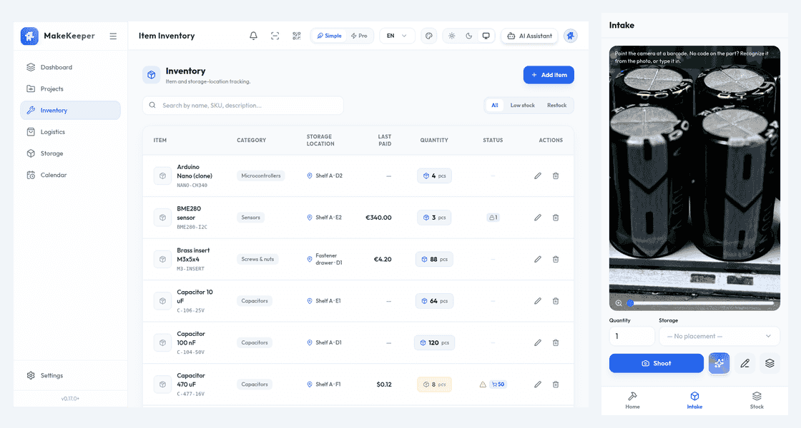
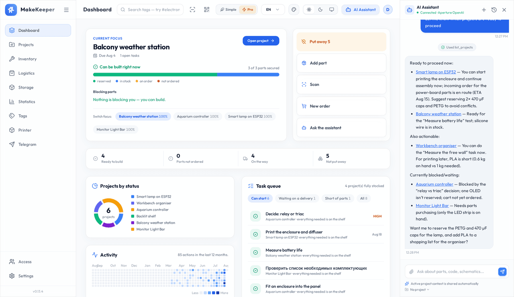
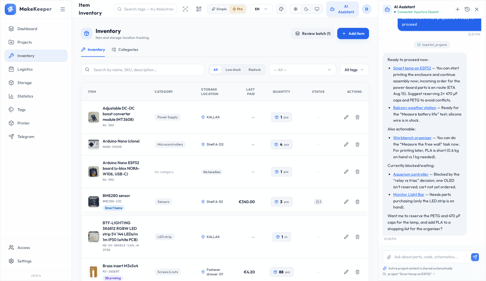
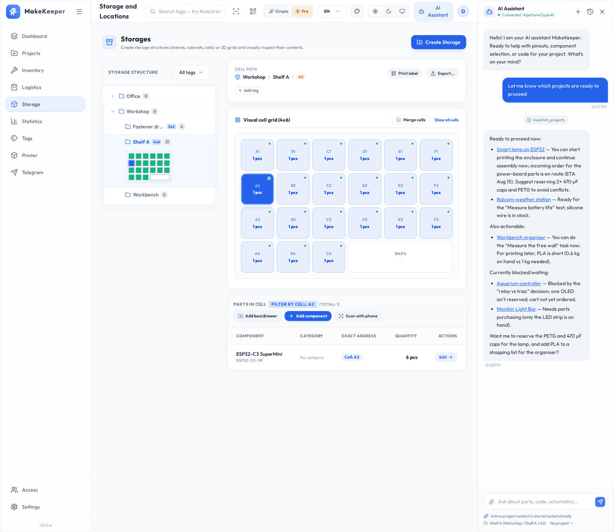

# MakeKeeper

> 🇷🇺 Русская версия: **[README.ru.md](README.ru.md)**

**You have the part. Somewhere.** MakeKeeper is a self-hosted workshop log: what you are building,
what you have on the shelf, where exactly it is, and what is still on its way — in one place, on
your own server.

<p align="center">
  
</p>

<p align="center"><em>Photograph a part with your phone. Name it. It is on the shelf — in the app.</em></p>

<picture>
  <source media="(prefers-color-scheme: dark)" srcset="docs/media/dashboard-dark.png">
  
</picture>

<picture>
  <source media="(prefers-color-scheme: dark)" srcset="docs/media/inventory-dark.png">
  
</picture>

<picture>
  <source media="(prefers-color-scheme: dark)" srcset="docs/media/storage-dark.png">
  
</picture>

---

## Install

One line on a clean machine with Docker:

```bash
curl -fsSL https://raw.githubusercontent.com/makekeeper/makekeeper/main/deploy/install.sh | bash
```

It generates the secrets, brings up the stack (backend + nginx + PostgreSQL) and prints the URL —
`http://localhost:8080` by default. The first start fills the instance with a **demo workshop** so
nothing begins as empty lists; one button in the app removes it when you are ready for your own
data. To update, re-run with `--update`: migrations apply themselves on start.

It also installs by hand with `docker compose`, or from **Coolify**, **Dokploy** or **Portainer** —
see **[INSTALL.md](INSTALL.md)** for the full guide, the variable reference, backup and restore.

---

## What it does

- **Know what you can build right now.** A project lists what it needs; MakeKeeper tells you what
  is reserved, what is on the shelf, what is on its way and what is missing — before you start.
- **Find the part.** Every item has a place: a shelf, a drawer, a cell in a grid. Search by name,
  by SKU, or scan the label you printed for it.
- **Never re-order what you already have.** Minimum stock levels, stock movements, and a shopping
  list computed from the shortages of the projects you are actually building.
- **Log the shelf where the shelf is.** Pair a phone, photograph parts one after another, and
  confirm the batch later at the desk — the phone is a real screen of the app, not a shrunken
  desktop.
- **Ask instead of clicking.** An optional AI assistant that can read and change your workshop
  through the app's own tools — every destructive step gated by your confirmation. Bring your own
  key: Gemini, OpenAI, Anthropic, Ollama or any OpenAI-compatible endpoint. Keys are encrypted at
  rest.
- **Be told, not reminded.** One inbox for everything the app notices — a delivery due, a part
  below its minimum, a reminder you set. You decide which of those also leave the app.
- **Keep it yours.** Your server, your database, your files. Export projects, storages or the whole
  instance as a `.mkx` archive and move it somewhere else.
- **Share it, or don't.** Single-user out of the box; optional accounts with per-user data
  isolation and shared scopes when the workshop is not only yours.

Everything above is a **plugin** — turn off what you do not use and it disappears from the
interface, the API and the assistant's tools. The app is not tied to electronics: it fits any craft
where you build things out of parts.

**More screens:** [the shopping list, and the parcels already on their way](docs/media/shopping-list-light.png) ·
[the calendar of everything due](docs/media/calendar-light.png) ·
[one project — tasks, reserved parts, budget](docs/media/project-detail-light.png). Each of them
also in dark, under [`docs/media/`](docs/media/).

---

## Under the hood

The stack, the plugin architecture, how to run it from source, the API and the developer documents:
**[docs/architecture.md](docs/architecture.md)**.

---

## License

MakeKeeper is **source-available**, not "open source" in the OSI sense.

- The application and first-party plugins (`apps/*`, `libs/plugin-*`) are licensed under the
  **Functional Source License, FSL-1.1-ALv2** ([`LICENSE.md`](LICENSE.md)). You may use, self-host,
  modify, fork and contribute for free; the only thing you may not do is a **Competing Use** — offer
  MakeKeeper, or something substantially similar, to others as a commercial or managed service. Two
  years after each release, that version additionally becomes available under **Apache-2.0**.
- The shared SDK libraries that plugin authors build on (`libs/plugin-contract`,
  `libs/frontend-core`, `libs/backend-core`) are licensed under **Apache-2.0**, so the plugin
  ecosystem is never subject to the FSL restriction.

See [`LICENSING.md`](LICENSING.md) for the full map and [`CONTRIBUTING.md`](CONTRIBUTING.md) for how
contributions are licensed. Need a commercial license? Open an issue to get in touch.

---

## Where to write

- **Something is broken** → [open an issue](https://github.com/makekeeper/makekeeper/issues/new/choose).
  The app can do it for you: **Settings → About → Report a problem** fills in your version, install
  method and enabled plugins before the form opens.
- **An idea, a question, or you just want to show what you built** →
  [Discussions](https://github.com/makekeeper/makekeeper/discussions).

Every message gets an answer within a day.

## Contributing

Issues and pull requests are read, and answered.

One thing to know before you send a patch: this GitHub repository is a **published mirror**.
Development happens in a private repository, and each release lands here as a single snapshot
commit that replaces the tree. A merged pull request would therefore vanish at the next release —
so patches are **ported by hand upstream** instead, credited in the commit message rather than in
the author field. Open an issue to discuss a change, or a pull request as the concrete form of the
proposal; both work. [`CONTRIBUTING.md`](CONTRIBUTING.md) has the sign-off every contribution needs.
