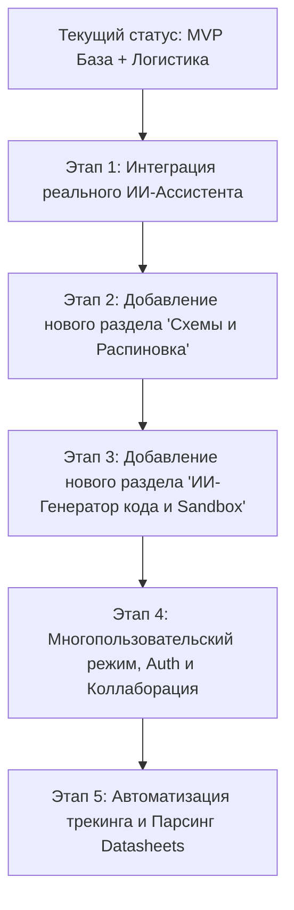
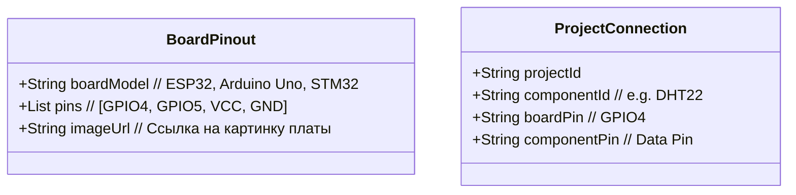

# Дорожная карта и план развития MakeKeeper

Этот план описывает шаги по расширению текущего функционала и добавлению новых специализированных разделов для инженеров и DIY-разработчиков.

---



---

## 🛠️ Текущий статус (Выполнено)
*   **Управление проектами (Projects View & Dashboard)**: Реализован детальный дашборд проекта с табами задач, склада и логистики.
*   **Интерактивный склад (Inventory)**: Добавлены операции создания, корректировки остатков и безопасного удаления радиодеталей с остатками и проверкой перекрестных зависимостей.
*   **Автоматизация логистики (Logistics & Warehouse)**: Оприходование деталей на склад при смене статуса заказа на «Доставлен». Создание заказов с позициями.
*   **Интерактивные задачи (Task dependencies)**: Связывание задач проекта с деталями и посылками.

---

## 🚀 Этап 1: Интеграция реального ИИ-Ассистента (AI Copilot)
Цель: подключить ИИ-чат на дашборде проекта к реальным языковым моделям, используя API провайдеров из раздела настроек.

1.  **Бэкенд-интеграция ИИ**:
    *   Создать контроллер `AIChatController` с эндпоинтом `POST /api/chat/projects/:projectId/message`.
    *   Реализовать сервис, который считывает дефолтную конфигурацию из `AIProviderConfig` (Gemini, OpenAI, Anthropic или локальный Ollama).
    *   Реализовать **System Prompt Builder**: ИИ должен получать не просто текст пользователя, а полный контекст проекта:
        ```json
        {
          "project_title": "Умная метеостанция",
          "tasks": ["Собрать датчики (Выполнено)", "Написать код для ESP32 (В процессе, зависит от доставки AliExpress)"],
          "components_reserved": ["ESP32 NodeMCU - 1 шт", "DHT22 - 1 шт"]
        }
        ```
    *   Сохранять историю диалога в таблицы `AIChatSession` и `AIChatMessage` в БД.
2.  **Фронтенд-интеграция**:
    *   Отображать статус печати ответа («ИИ думает...»).
    *   Форматировать ответы ИИ (поддержка Markdown, блоков кода, ссылок на детали).

---

## 🎨 Этап 2: НОВЫЙ РАЗДЕЛ — «Схемы и Распиновка» (Pinout Board)
Цель: избавить разработчика от поиска распиновок контроллеров в Google Images и дать возможность проектировать связи.



1.  **Интерфейс «Схемы и распиновка»**:
    *   Визуальный виджет платы микроконтроллера (например, 3D или 2D векторный рендер ESP32 DevKit).
    *   Подсветка пинов (GND - черный, VCC - красный, GPIO - синий, ADC - фиолетовый).
    *   Таблица физического подключения: «Датчик влажности DHT22 -> подключен к пину GPIO4 на ESP32».
2.  **Валидация ИИ**:
    *   Кнопка «Проверить схему через ИИ»: ассистент анализирует таблицу связей и сообщает о критических ошибках (например, «Внимание! Датчик подключен к пину 5V, но он работает только от 3.3V»).

---

## 💻 Этап 3: НОВЫЙ РАЗДЕЛ — «ИИ-Генератор кода и Sandbox»
Цель: генерация рабочих прошивок (C++ для Arduino, MicroPython) на основе деталей проекта и выбранных связей пинов.

1.  **ИИ Генератор прошивки**:
    *   Кнопка «Сгенерировать код для проекта». ИИ анализирует схему подключения из Этапа 2 и подключенные компоненты, генерируя прошивку.
2.  **Веб-редактор кода (Monaco Editor)**:
    *   Интеграция полноценного редактора кода (как в VS Code) прямо в веб-интерфейс.
    *   Подсветка синтаксиса, автодополнение, мини-карта.
3.  **ИИ Отладчик**:
    *   Форма ввода ошибки компилятора: пользователь вставляет лог ошибки, ИИ предлагает исправление кода в один клик.

---

## 👥 Этап 4: Многопользовательский режим (Multi-User, Auth & Collaboration)
Цель: масштабирование приложения в облачную платформу с совместной работой.

1.  **Аутентификация & JWT**:
    *   Реализация регистрации, входа и восстановления пароля.
    *   JwtAuthGuard на бэкенде, роутинг-гварды на фронтенде.
2.  **Совместная разработка проектов (Shared Workspace)**:
    *   Возможность пригласить друга в проект по Email (роли: `OWNER`, `EDITOR`, `VIEWER`).
    *   Общий список задач, общие резервы на складе, общий лог изменений.

---

## 📦 Этап 5: Автоматизация логистики и парсинг документации
1.  **Авто-трекинг посылок**:
    *   Интеграция с API (Cainiao, AliExpress, Почта России) для автоматического парсинга статусов по трек-номерам каждые 6 часов.
2.  **ИИ Парсинг Datasheets (Распознавание PDF)**:
    *   Пользователь загружает PDF-даташит детали. ИИ парсит его, вытаскивает схему распиновки, технические характеристики (напряжение, токи) и автоматически заполняет карточку компонента в инвентаре.
