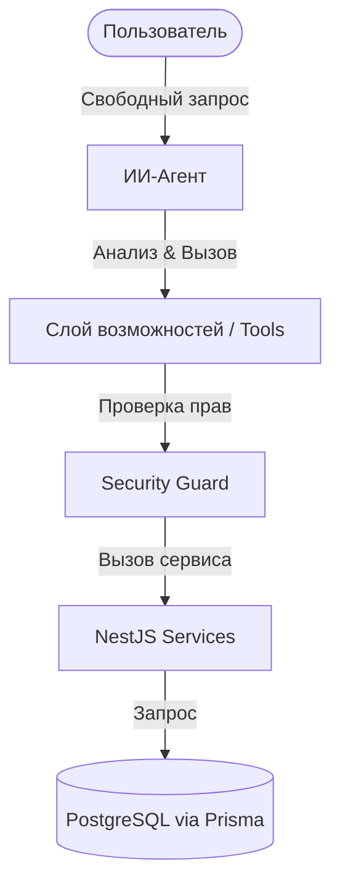

# 🤖 Слой возможностей агента (Agent Capabilities Layer)

Документ описывает архитектурный подход к проектированию взаимодействия ИИ-агентов (как встроенных, так и внешних через MCP-сервер) с функционалом приложения **MakeKeeper**.

---

## 🎯 Основная идея

Вместо реализации жестких сценариев автоматизации под каждую конкретную задачу (например, «заполнение по фото», «перенос ящиков»), все плагины бэкенда должны предоставлять **атомарные возможности (инструменты / Tools)**.

Агент самостоятельно комбинирует эти возможности в цепочки вызовов (tool chaining) для решения непредсказуемых запросов пользователя.



---

## 🔒 Уровни доступа и Безопасность

Для предотвращения случайного удаления данных или несанкционированного изменения состояния системы, все инструменты разделяются на три уровня прав (`Permission Level`):

### 1. `READ` (Чтение данных)
* **Описание**: Безопасный доступ к чтению таблиц, поиску деталей, получению логов или структуры.
* **Примеры**: Поиск резистора на складе, просмотр списка задач проекта, чтение истории заказов.
* **Политика**: Выполняется автоматически без дополнительного подтверждения пользователем.

### 2. `WRITE` / `MUTATION` (Добавление и обновление данных)
* **Описание**: Изменение состояния системы, добавление новых записей, корректировка количеств.
* **Примеры**: Регистрация новой детали, изменение размеров сетки ящика, отметка задачи как выполненной, создание заказа.
* **Политика**: по умолчанию — как и `DESTRUCTIVE` — ставится на подтверждение
  пользователя (`CONFIRM`) перед выполнением: любое изменение данных гейтится
  Human-in-the-loop. Администратор может ослабить конкретный инструмент до `AUTO`
  в настройках — тогда он выполняется автоматически, но с выводом уведомления о
  совершённом действии (и/или записью в журнал изменений `ActivityLog`). Дефолт
  применяется только при первой регистрации инструмента; уже сохранённые в БД
  настройки не перезаписываются, поэтому ручные переопределения администратора
  сохраняются. Источник дефолта — единый хелпер `defaultConfirmationPolicy`.

### 3. `DESTRUCTIVE` (Разрушающие действия)
* **Описание**: Удаление записей, очистка таблиц, действия, которые невозможно легко отменить.
* **Примеры**: Удаление ячейки склада (Storage), удаление компонента, удаление всего проекта.
* **Политика**: **Строго требует явного подтверждения от пользователя** (Human-in-the-loop). Агент обязан приостановить выполнение, показать пользователю форму подтверждения и выполнить операцию только после явного клика «Да» / ввода команды согласия.

---

## 💬 Карточка подтверждения — обязательный `confirmSummary`

Когда вызов инструмента ставится на подтверждение пользователю (по умолчанию любой
`WRITE` или `DESTRUCTIVE`, а также любой инструмент, которому выставлена политика
`CONFIRM`; `WRITE` администратор может вручную ослабить до `AUTO`), чат показывает
**карточку подтверждения**. Она обязана быть человекопонятной:
короткое локализованное предложение с реальными именами сущностей, а **не** имя метода
и сырой JSON аргументов (то есть никаких `adjust_component_quantity {"componentId":"comp_x","amount":-1}`).

**Политика (действует и для будущих доработок):** каждый инструмент уровня `WRITE` и
`DESTRUCTIVE` **обязан** объявлять `confirmSummary`. Инструмент `READ` — по желанию
(он попадает под подтверждение только если пользователь сам включил `CONFIRM`).

Механизм (`AgentTool.confirmSummary`):

```typescript
confirmSummary: async (args) => {
  // Резолвим id → человеческое имя через сервис ЭТОГО же плагина.
  const comp = await inventoryService.findOne(String(args.componentId));
  return {
    // Ключ i18n живёт в i18n/{en,ru}.json этого плагина под объектом "agentConfirm".
    key: 'agentConfirm.adjust_component_quantity',
    // Только уже разрешённые имена/числа как строки — НЕ куски UI-текста
    // (иначе они не переведутся). Разные формулировки → разные ключи.
    params: { name: comp?.name ?? String(args.componentId), amount: '+5' },
  };
},
```

Правила:

* Ключ — `agentConfirm.<tool_name>` в `libs/plugin-<id>/src/i18n/en.json` **и** `ru.json`
  (оба обязательны, в одном коммите; §5.5 CLAUDE.md).
* `params` содержит только подставляемые значения (имена сущностей, числа как строки),
  не фрагменты интерфейсного текста. Для разных исходов (например «выполнить» /
  «вернуть в работу») заводи отдельные ключи и выбирай нужный в `confirmSummary`.
* Резолвер — best-effort: `chat.service.ts#buildConfirmSummary` глушит любые ошибки, а
  фронтенд откатывается на имя метода + аргументы. Это аварийный путь, не норма.
* `AgentRegistryService` на старте предупреждает в лог о любых `WRITE`/`DESTRUCTIVE`
  инструментах без `confirmSummary` — не игнорируй это предупреждение.

---

## 🏗️ Архитектурный паттерн для плагинов

Каждый плагин в каталоге `apps/backend/src/app/plugins/<plugin-name>` при расширении возможностей должен декларировать свои инструменты.

Инструмент описывается интерфейсом:

```typescript
export enum PermissionLevel {
  READ = 'READ',
  WRITE = 'WRITE',
  DESTRUCTIVE = 'DESTRUCTIVE'
}

export interface AgentTool {
  name: string;             // Уникальное имя (snake_case)
  description: string;      // Описание для LLM (зачем нужен инструмент)
  schema: any;              // JSON Schema / Zod-схема входных параметров
  permission: PermissionLevel;
  handler: (args: any, context: any) => Promise<any>;
}
```

### Пример описания инструментов в плагине складов (`storages`):

```typescript
// apps/backend/src/app/plugins/storages/storages.tools.ts

import { PermissionLevel, AgentTool } from '../../utils/agent-types';
import { z } from 'zod';

export const storageTools = (storagesService: StoragesService): AgentTool[] => [
  {
    name: 'get_storage_details',
    description: 'Возвращает структуру ячейки хранения (размеры сетки) и список находящихся в ней деталей.',
    permission: PermissionLevel.READ,
    schema: z.object({
      storageId: z.string().describe('ID ячейки хранения')
    }),
    handler: async (args) => {
      return storagesService.findOne(args.storageId);
    }
  },
  {
    name: 'update_storage_grid',
    description: 'Обновляет структуру сетки ячейки хранения (количество строк и колонок для разделенного ящика).',
    permission: PermissionLevel.WRITE,
    schema: z.object({
      storageId: z.string().describe('ID ячейки хранения'),
      rows: z.number().describe('Количество строк (рядов)'),
      cols: z.number().describe('Количество колонок')
    }),
    handler: async (args) => {
      return storagesService.update(args.storageId, { gridRows: args.rows, gridCols: args.cols });
    }
  },
  {
    name: 'delete_storage_cell',
    description: 'Удаляет ячейку хранения. ВНИМАНИЕ: Все вложенные детали потеряют привязку к складу.',
    permission: PermissionLevel.DESTRUCTIVE,
    schema: z.object({
      storageId: z.string().describe('ID удаляемой ячейки')
    }),
    handler: async (args) => {
      return storagesService.delete(args.storageId);
    }
  }
];
```

---

## 🔗 Ссылки на объекты (ORef) во вводе/выводе инструментов

Каждый инструмент, принимающий id объекта, принимает и каноническую **ORef** того же
типа: разбирай вход через `resolveEntityId(input, { pluginId, entityType })` — сырой
id проходит как есть, ORef чужого плагина/типа → корректируемая ошибка (а не тихий
поиск не того объекта). В ответах инструмента добавляй поле `ref` с канонической
ссылкой на возвращаемый объект, чтобы агент мог передать её обратно в другой
инструмент без реконструкции. Грамматика, реестр типов и рецепт резолверов —
[`object-refs.md`](object-refs.md).

---

## ⚙️ Интеграция: от Встроенных инструментов (Option A) к MCP (Option B)

Такой подход позволяет легко масштабировать интерфейс взаимодействия:

1. **Встроенный агент (Option A)**:
   При формировании запроса к LLM в `chat.service.ts` собирается реестр инструментов от всех плагинов. Инструменты со статусом `READ` и `WRITE` передаются в модель. Для `DESTRUCTIVE` инструментов генерируется промежуточный хук, требующий ответа пользователя.
   
2. **MCP-сервер (Option B)**:
   При поднятии MCP-сервера он опрашивает общий реестр плагинов и автоматически транслирует массив `AgentTool[]` в MCP-протокол:
   - `name` и `description` передаются в описание MCP Tool.
   - `schema` транслируется в JSON Schema.
   - Уровень безопасности проверяется на стороне MCP-сервера перед вызовом `handler`.
